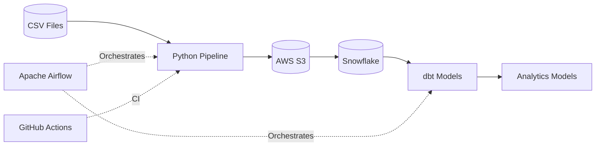

<div align="center">

# Data Engineering Pipeline

<br>

<p>
An end-to-end Data Engineering pipeline built with Python, AWS S3, Snowflake, Apache Airflow, dbt, Docker, and GitHub Actions.
</p>

<br>

<p>
ETL • Orchestration • Cloud Storage • Data Warehouse • Analytics Engineering
</p>

<br>

<p>• • •</p>

<br>

[](https://github.com/Sepahsalar/data-pipeline/actions)
[](https://www.python.org/)
[](https://airflow.apache.org/)
[](https://www.getdbt.com/)
[](https://www.snowflake.com/)
[](https://aws.amazon.com/s3/)
[](https://www.docker.com/)
[](https://docs.pytest.org/)
[](https://github.com/Sepahsalar/data-pipeline)
[](LICENSE)

<br>

*Designed as a portfolio project to demonstrate modern Data Engineering practices and production-oriented project structure.*

</div>

---

## Table of Contents
- [Overview](#overview)
- [Features](#features)
- [Architecture](#architecture)
- [Tech Stack](#tech-stack)
- [Project Structure](#project-structure)
- [Getting Started](#getting-started)
  - [Prerequisites](#prerequisites)
  - [Clone Repository](#clone-repository)
  - [Virtual Environment](#virtual-environment)
  - [Install Dependencies](#install-dependencies)
  - [Configuration](#configuration)
- [Running the Pipeline](#running-the-pipeline)
- [Running Airflow](#running-airflow)
- [Running dbt](#running-dbt)
- [Running Tests](#running-tests)
- [Makefile Usage](#makefile-usage)
- [Docker](#docker)
- [Continuous Integration (CI)](#continuous-integration-ci)
- [Pipeline Workflow](#pipeline-workflow)
- [Testing](#testing)
- [Future Improvements](#future-improvements)
- [Why This Project?](#why-this-project)
- [Contact](#contact)
- [License](#license)

---

## Overview

**Data Engineering Pipeline** is a demonstration of an end-to-end modern data engineering workflow. It showcases how to ingest, transform, and orchestrate data using Python, AWS S3, Snowflake, Apache Airflow, dbt, Docker, pytest, and GitHub Actions.

The pipeline covers the full journey:
1. Extract raw data.
2. Transform and validate.
3. Upload to AWS S3.
4. Load into Snowflake.
5. Build analytics models with dbt.
6. Orchestrate with Apache Airflow.
7. Validate automatically with GitHub Actions.

The project emphasizes modular design, reproducibility, automated testing, and maintainability while using tools commonly found in modern data engineering environments.

---

## Features

- **Data Ingestion**: Extract data from CSV files using Python.
- **Data Transformation**: Cleanse, validate, and prepare data for analytics.
- **AWS S3 Upload**: Store staged data files in S3 buckets.
- **Snowflake Loading**: Load data from S3 into Snowflake tables.
- **dbt Models & Tests**: Build analytics models and run tests with dbt.
- **Airflow Orchestration**: DAGs coordinate the ETL, dbt, and data validation steps.
- **Docker Support**: Run the pipeline and Airflow in isolated containers.
- **Continuous Integration**: Automated testing and Docker image builds with GitHub Actions.
- **Logging & Monitoring**: Track pipeline execution and errors.
- **Configurable**: Environment-based configuration for credentials and resources.
- **Cleanup**: Remove generated artifacts for repeatable local executions.
- **Testing**: Unit and integration tests with pytest.

---

## Architecture



---

## Tech Stack

| Area             | Technology               |
|------------------|--------------------------|
| Language         | Python 3.12              |
| Orchestration    | Apache Airflow           |
| Data Warehouse   | Snowflake                |
| Transformation   | dbt                      |
| Cloud Storage    | AWS S3                   |
| Containerization | Docker, Docker Compose   |
| CI/CD            | GitHub Actions           |
| Testing          | pytest                   |
| Configuration    | dotenv (.env)            |

---

## Project Structure

<details>
<summary>Project Tree</summary>

```text
data-pipeline/
├── airflow/                  # Airflow configuration (DAGs, plugins)
├── dbt/                      # dbt project (models, seeds, tests)
├── src/
│   ├── common/               # Configuration, logging, cleanup
│   ├── etl/                  # Ingestion, transformation and S3 upload
│   └── warehouse/            # Snowflake loading
├── data/                     # Sample source data (CSV files)
├── docker/                   # Dockerfiles and compose config
├── requirements/             # Dependency files
├── .github/
│   └── workflows/            # GitHub Actions CI
├── tests/                    # Unit and integration tests
├── Makefile                  # Automation commands
├── .env.example              # Example environment variables
├── README.md                 # Project documentation
└── ...                       # Other supporting files
```
</details>

| Directory/File    | Description                                    |
|-------------------|------------------------------------------------|
| `airflow/`        | Airflow DAGs, config, and plugins              |
| `dbt/`            | dbt project: models, seeds, and tests          |
| `src/`            | Python source code (ETL, common utilities, warehouse) |
| `data/`           | Raw sample data files (CSV)                    |
| `docker/`         | Dockerfiles, docker-compose.yml                |
| `tests/`          | All tests: unit, integration, dbt              |
| `Makefile`        | Automation commands for dev workflow           |
| `.env.example`    | Example environment configuration              |
| `README.md`       | Project documentation                          |

---

## Getting Started

### Prerequisites
- Python 3.12+
- Docker & Docker Compose
- [AWS account](https://aws.amazon.com/) (for S3)
- [Snowflake account](https://signup.snowflake.com/)

### Clone Repository
```bash
git clone https://github.com/Sepahsalar/data-pipeline.git
cd data-pipeline
```

### Virtual Environment
```bash
python3.12 -m venv venv
source venv/bin/activate
```

### Install Dependencies
```bash
pip install -r requirements/dev.txt
```

### Configuration
Copy the example environment variables and fill in your credentials:
```bash
cp .env.example .env
```

| Variable                  | Description                        |
|---------------------------|------------------------------------|
| `RAW_SOURCE_FILE`         | Path to the raw source CSV file    |
| `RAW_INGESTED_FILE`       | Path to the ingested CSV file      |
| `CLEANED_FILE`            | Path to the cleaned CSV file       |
| `S3_BUCKET`               | AWS S3 bucket name                 |
| `POSTGRES_USER`           | Postgres username (if used)        |
| `POSTGRES_PASSWORD`       | Postgres password (if used)        |
| `POSTGRES_DB`             | Postgres database name (if used)   |
| `SNOWFLAKE_USER`          | Snowflake username                 |
| `SNOWFLAKE_ACCOUNT`       | Snowflake account identifier       |
| `SNOWFLAKE_PRIVATE_KEY`   | Snowflake private key              |
| `SNOWFLAKE_WAREHOUSE`     | Snowflake warehouse                |
| `SNOWFLAKE_DATABASE`      | Snowflake database                 |
| `SNOWFLAKE_SCHEMA`        | Snowflake schema                   |
| `SNOWFLAKE_TABLE`         | Snowflake table name               |
| `SNOWFLAKE_ROLE`          | Snowflake role                     |

---

## Running the Pipeline

**Direct Python ETL**
```bash
python run_pipeline.py
```
This will execute the ETL pipeline: read CSV → transform → upload to S3 → load into Snowflake.

Alternatively:

```bash
make pipeline
```

---

## Running Airflow

**Local Airflow (virtualenv):**
```bash
export AIRFLOW_HOME=$(pwd)/airflow
airflow db init
airflow users create --username admin --password admin --role Admin --email admin@example.com
airflow webserver --port 8080
airflow scheduler
```
Visit [http://localhost:8080](http://localhost:8080) and trigger the DAG.

**Docker Compose:**
```bash
docker compose up
```

---

## Running dbt

```bash
cd dbt
dbt run
dbt test
dbt docs generate
dbt docs serve
```

---

## Running Tests

```bash
python -m pytest
```

```bash
make test
```

---

## Makefile Usage

The Makefile provides the following automation targets:

| Target         | Description                                            |
|----------------|-------------------------------------------------------|
| `help`         | Show help message with available targets               |
| `install`      | Install production dependencies                       |
| `install-dev`  | Install development dependencies                      |
| `venv-check`   | Check if the Python virtual environment is activated  |
| `pipeline`     | Run the ETL pipeline                                  |
| `reset-data`   | Remove generated CSV files from the data directory    |
| `test`         | Run all tests (pytest)                                |
| `coverage`     | Run test coverage report                              |
| `dbt-run`      | Run dbt models                                        |
| `dbt-test`     | Run dbt tests                                         |
| `check`        | Run pytest and dbt tests                              |
| `docs`         | Generate dbt documentation                            |
| `serve`        | Serve dbt documentation locally                       |
| `clean`        | Remove Python cache files and dbt artifacts           |

Use with:
```bash
make <target>
```

---

## Docker

- **ETL Docker Image**: Containerizes the Python ETL scripts for reproducibility.
- **Airflow Docker Image**: Runs Airflow webserver and scheduler in containers.
- **docker-compose.yml**: Orchestrates Airflow, ETL, and supporting services for local development.

Build and start all services:
```bash
docker compose up --build
```

This starts the services defined in `docker-compose.yml`, allowing the pipeline components to run in a reproducible environment.

---

## Continuous Integration (CI)

Every push and pull request to the `main` branch automatically runs the pytest suite and builds both Docker images using GitHub Actions, as defined in `.github/workflows/ci.yml`.

---

## Pipeline Workflow

1. **Ingest**: Python reads raw CSV files from `/data`.
2. **Transform**: Data is cleaned, validated, and staged.
3. **Upload**: Staged data is uploaded to AWS S3.
4. **Load**: The processed data is loaded into Snowflake.
5. **Transform**: dbt models build analytics-ready tables and run data quality tests.
6. **Validation**: dbt and custom tests confirm data quality.
7. **Cleanup**: Optionally remove temp data for repeatability.

---

## Testing

- All Python code is covered by **pytest** unit and integration tests.
- dbt models are tested with built-in dbt tests.
- Run all tests:
    ```bash
    python -m pytest
    ```

---

## Future Improvements

- Add support for additional data sources (APIs, databases)
- Automated data quality checks and alerts
- Airflow deployment to cloud (e.g., AWS MWAA)
- Data lineage visualization integration
- Enhanced monitoring and alerting
- Parameterized/configurable pipelines
- Automated documentation generation

---

## Why This Project?

This repository was built as a portfolio project to demonstrate practical data engineering skills rather than as a production business application. It showcases clean and organized project structure, emphasizing best practices in code organization and modularity. The project highlights the use of testing frameworks to ensure code quality and reliability.

It integrates orchestration using Apache Airflow to manage complex workflows and demonstrates containerization with Docker for reproducibility and environment consistency. Additionally, it incorporates analytics engineering using dbt to build robust data models. Continuous integration via GitHub Actions ensures that the pipeline remains tested and deployable. Overall, this project serves as a comprehensive example of modern data engineering principles and tools.

---

## Contact

- **GitHub**: [Sepahsalar](https://github.com/Sepahsalar)
- **LinkedIn**: [Alireza Sohrabizadeh](https://www.linkedin.com/in/alireza-sohrabizadeh/)
- **Email**: alirezasohrabizadeh@gmail.com

---

## License

This project is licensed under the [MIT License](LICENSE).

<div align="center">
⭐ If this project helped you or you found it interesting, consider giving it a star on GitHub!
</div>